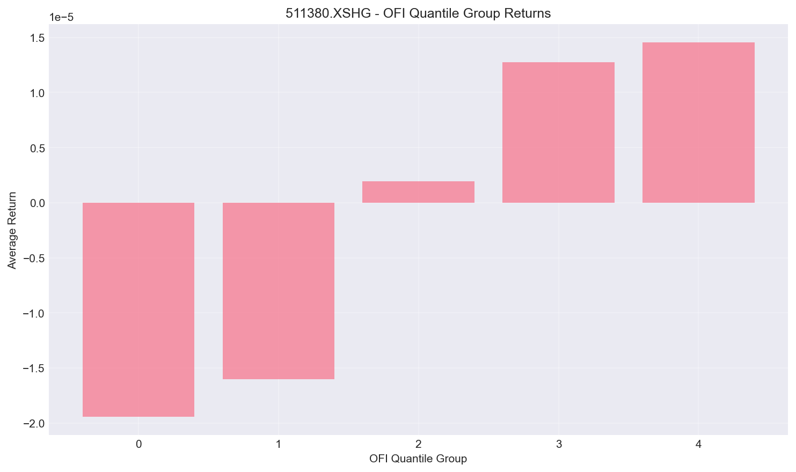
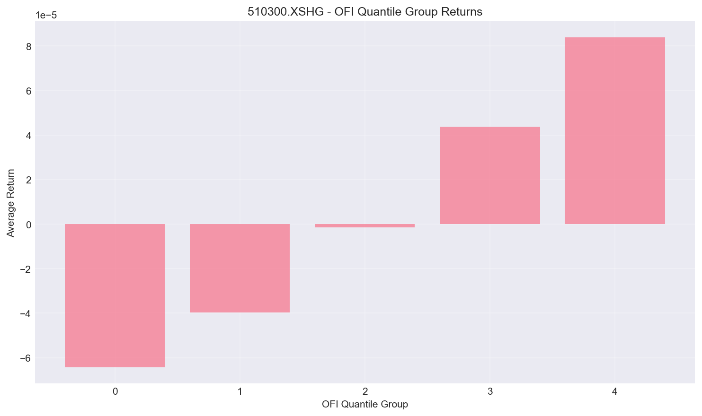
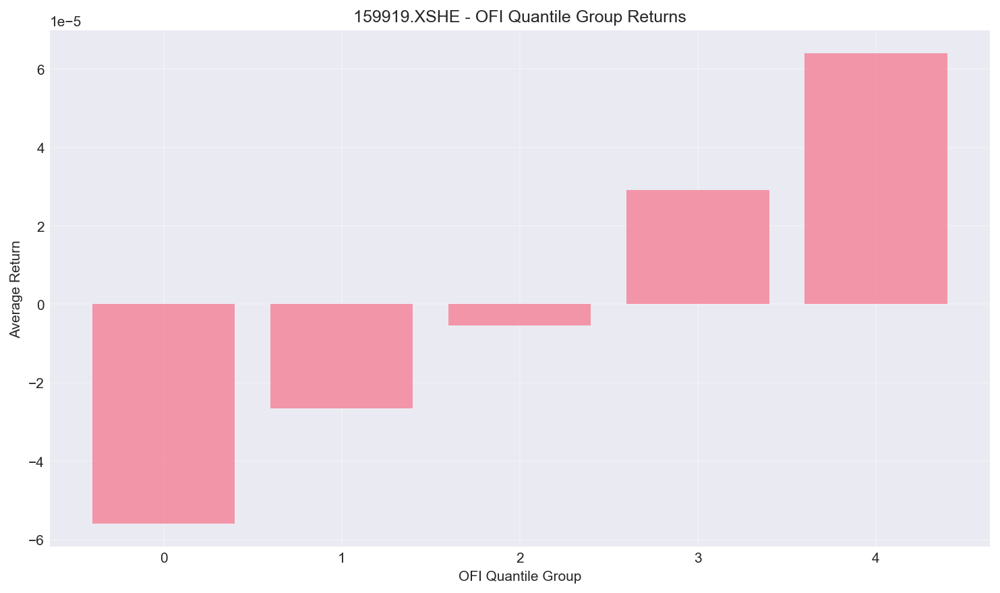
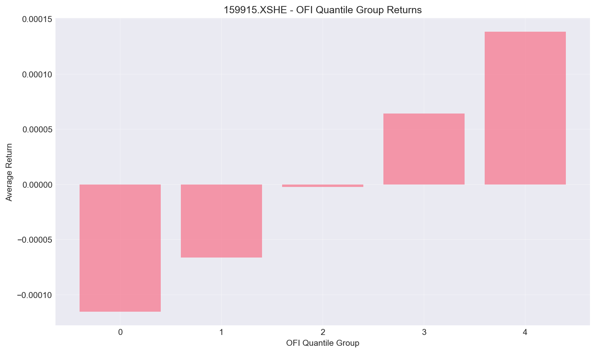
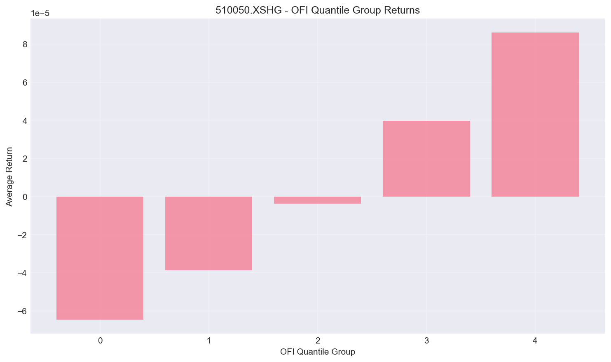

# OFI信号分析报告（增强版）

## 1. 信息系数（IC）汇总

### 1.1 各标的IC统计

| 标的 | IC | IC p值 | RankIC | RankIC p值 | 样本数 |
|------|-------|---------|---------|------------|--------|
| 511380.XSHG | 0.0227 | 2.6373e-39 | 0.0565 | 2.2216e-234 | 334,638 |
| 510300.XSHG | -0.0069 | 4.8920e-05 | 0.1061 | 0.0000e+00 | 349,640 |
| 518880.XSHG | 0.0700 | 0.0000e+00 | 0.0988 | 0.0000e+00 | 349,495 |
| 159919.XSHE | 0.0587 | 9.8504e-262 | 0.0773 | 0.0000e+00 | 346,247 |
| 159915.XSHE | 0.0904 | 0.0000e+00 | 0.1134 | 0.0000e+00 | 345,884 |
| 510050.XSHG | 0.0228 | 2.6207e-41 | 0.1086 | 0.0000e+00 | 349,633 |

### 1.2 整体统计

- **平均IC**: 0.0429 ± 0.0361
- **IC t统计量**: 2.91
- **平均RankIC**: 0.0935 ± 0.0221
- **RankIC t统计量**: 10.35
- **总样本数**: 2,075,537

### 1.3 结果解读

✅ **RankIC显著为正**：OFI对下一分钟收益率有较强的预测能力

✅ **统计显著性强**：t统计量 = 10.35，远超显著性阈值(±2)

### 1.4 IC vs RankIC对比

- IC: 0.0429 (Pearson相关系数，衡量线性关系)
- RankIC: 0.0935 (Spearman相关系数，衡量单调关系)

**RankIC > IC**：表明OFI与收益率更多是单调关系而非线性关系，建议使用排序类策略

## 2. 分位数组收益率

按OFI大小将样本分为5组，观察各组的平均收益率：

### 511380.XSHG

### 510300.XSHG

### 518880.XSHG

### 159919.XSHE

### 159915.XSHE

### 510050.XSHG

## 3. 策略建议

基于以上分析，对OFI因子的使用建议如下：

### ✅ 推荐使用

1. **因子有效性**：RankIC显著为正，预测能力强
2. **策略类型**：建议使用分组策略或排序策略
3. **持仓周期**：1分钟（基于当前分析）
4. **风险提示**：
   - 注意交易成本（高频交易）
   - 监控滑点影响
   - 考虑组合构建以降低个股风险

## 4. 后续分析方向

1. **分层分析**：
   - 按市场状态分层（高波动/低波动）
   - 按时段分层（开盘/收盘/午间）

2. **衰减分析**：
   - 观察OFI对未来1/3/5/10分钟收益的预测能力衰减

3. **组合优化**：
   - 与其他因子（成交量、波动率）组合
   - 构建多因子模型

4. **回测验证**：
   - 完整的回测框架
   - 考虑交易成本、滑点
   - 计算夏普比率、最大回撤等指标

