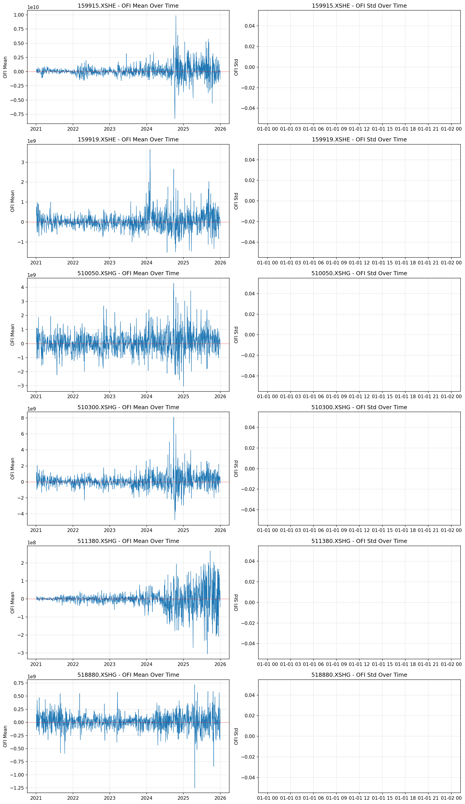

# Day3 数据质量报告

生成时间: 2026-02-01 00:33:53.642034

## 1. 总体统计

- 检查文件数: 7271
- 成功处理: 7271
- 标的数量: 6
- 标的列表: 159915.XSHE, 159919.XSHE, 510050.XSHG, 510300.XSHG, 511380.XSHG, 518880.XSHG

## 2. 分钟覆盖率

| symbol      |     mean |      min |      max |   count |
|:------------|---------:|---------:|---------:|--------:|
| 159915.XSHE | 0.995462 | 0.745833 | 0.995833 |    1211 |
| 159919.XSHE | 0.995686 | 0.966667 | 0.995833 |    1212 |
| 510050.XSHG | 1.00549  | 1        | 1.00833  |    1212 |
| 510300.XSHG | 1.00557  | 1        | 1.00833  |    1212 |
| 511380.XSHG | 1.00471  | 1        | 1.00833  |    1212 |
| 518880.XSHG | 1.005    | 1        | 1.00833  |    1212 |

## 3. Book异常率 (平均%)

| 异常类型 | 比例 |
|---------|------|
| spread_negative | 0.0005% |
| mid_negative | 0.0000% |
| bid_ge_ask | 0.0005% |

## 4. OFI分布稳定性

### 按标的统计

| symbol      |   ('ofi_mean', 'mean') |   ('ofi_mean', 'std') |   ('ofi_std', 'mean') |   ('ofi_std', 'std') |
|:------------|-----------------------:|----------------------:|----------------------:|---------------------:|
| 159915.XSHE |            1.17252e+08 |           1.12734e+09 |                   nan |                  nan |
| 159919.XSHE |            3.58347e+07 |           4.23559e+08 |                   nan |                  nan |
| 510050.XSHG |            6.5038e+07  |           7.53634e+08 |                   nan |                  nan |
| 510300.XSHG |            1.00417e+08 |           8.59778e+08 |                   nan |                  nan |
| 511380.XSHG |           -1.65076e+06 |           5.22389e+07 |                   nan |                  nan |
| 518880.XSHG |            1.79509e+07 |           1.49918e+08 |                   nan |                  nan |

## 5. 数据质量建议

⚠️ **警告**: 1 个文件的分钟覆盖率 < 90%

⚠️ **警告**: 1 个文件的spread异常率 > 1%

⚠️ **警告**: 35 个文件的OFI均值异常（超过5倍标准差）

